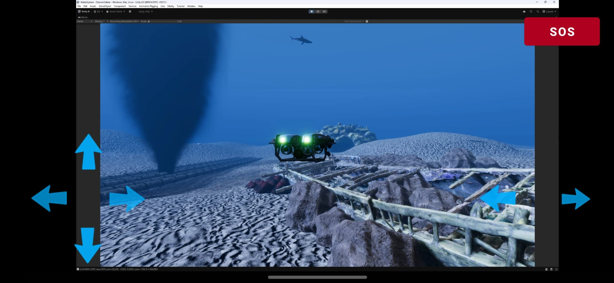
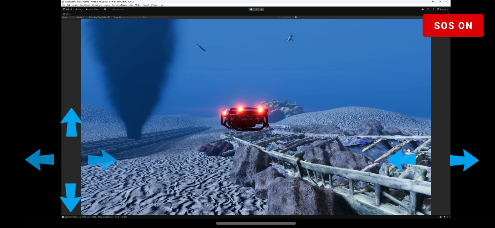

# BlueROV2 Android Controller

Android-based remote control and video monitoring interface developed for a distributed BlueROV2 co-simulation environment.

The application provides low-latency UDP video playback, touch-based vehicle motion commands, simulated pose generation, haptic feedback, and an emergency signaling mechanism for communication with a Unity-based simulation host.

## Demo

The Android interface displays the live simulation stream while providing touch-based vehicle control and emergency signaling.

<p align="center">
  
  
</p>

<p align="center">
  <em>Normal operation and emergency (SOS) state during Unity co-simulation.</em>
</p>

## Cross-Simulation Demonstration

The UDP-based controller architecture was also prototyped with an Unreal Engine UAV simulation during an earlier development stage.

This experiment demonstrates that the mobile controller and network communication approach are not tied to a specific vehicle or simulation engine. The same general architecture was used to control a simulated UAV in Unreal Engine while receiving the simulation view on the Android device.

This repository contains the BlueROV2 / Unity-oriented version of the controller.

### Unreal Engine UAV Prototype

[▶ Watch the UAV simulation demo](docs/media/unreal_uav_demo.mp4)

## Features

- Android controller interface written in Kotlin
- Live UDP video playback using LibVLC
- Touch-based forward, backward, lateral, and yaw controls
- Approximately 60 Hz continuous control update loop
- Body-relative motion converted into simulation world coordinates
- Little-endian UDP pose packets for Unity integration
- Haptic feedback for control inputs
- Long-press emergency toggle with dedicated UDP signaling
- Landscape-oriented full-screen controller interface

## System Overview

```text
                    UDP video stream :1234
        ┌──────────────────────────────────────┐
        │                                      ▼
┌───────────────────┐                 ┌─────────────────────┐
│ Unity / Host PC   │                 │   Android Device    │
│                   │                 │                     │
│ Simulation        │◄──── UDP ───────│ Touch Controller    │
│ Pose Receiver     │      :5007      │                     │
│                   │                 │ LibVLC Video Player │
│ Emergency Handler │◄──── UDP ───────│ Emergency Control   │
└───────────────────┘      :5012      └─────────────────────┘
```

The Android device receives the live video stream while simultaneously transmitting controller-generated pose updates to the simulation host.

## Controls

The touch interface provides six active motion commands:

| Control | Motion |
|---|---|
| Forward | Forward translation |
| Backward | Reverse translation |
| Left | Strafe left |
| Right | Strafe right |
| Yaw Left | Rotate left |
| Yaw Right | Rotate right |

Pitch controls are intentionally disabled in the current interface.

Button presses provide haptic and visual feedback. Holding a motion button continuously generates control updates at approximately 60 Hz.

## Pose Generation

Motion commands are converted from body-relative directions into the simulation world frame using the current yaw angle.

The controller maintains an internal kinematic state:

```text
wx      World X position
wz      World Z position
height  Vertical reference
yaw     Vehicle heading
```

The resulting coordinates are transformed into the Unity coordinate convention before transmission.

This application generates a simulated pose for the co-simulation environment; it does not directly send MAVLink or ArduSub commands to the physical vehicle.

## UDP Pose Packet

Pose data is transmitted to the host on UDP port `5007`.

Each packet contains nine 32-bit floating-point values encoded in little-endian order:

```text
<9f
```

Packet layout:

| Index | Value |
|---:|---|
| 0 | Unity X |
| 1 | Unity Z |
| 2 | Unity Y |
| 3 | Pitch |
| 4 | Roll |
| 5 | Yaw |
| 6 | Elapsed time |
| 7 | Sequence number |
| 8 | Delta time |

Pitch and roll are currently fixed at zero.

The default development configuration uses:

```text
Host IP:        192.168.137.1
Pose port:      5007
Emergency port: 5012
Video port:     1234
```

These values correspond to the development hotspot/network configuration and can be changed in `FirstFragment.kt`.

## Emergency Signaling

The interface includes a dedicated SOS button.

To prevent accidental activation, the button must be held for approximately three seconds. During the hold period, periodic haptic feedback is provided.

The controller toggles between:

```text
EMERGENCY
EMERGENCY_OFF
```

and sends the corresponding UTF-8 UDP message to port `5012`.

## Video Streaming

The application uses LibVLC to receive a UDP video stream:

```text
udp://@:1234
```

Playback is configured for low latency using reduced caching, frame dropping, hardware decoding, and disabled audio.

For development testing on Windows, an FFmpeg stream can be sent to the Android device:

```powershell
ffmpeg -f gdigrab -framerate 30 -i desktop `
-c:v libx264 -preset ultrafast -tune zerolatency `
-pix_fmt yuv420p -g 30 `
-f mpegts "udp://PHONE_IP:1234?pkt_size=1316"
```

Replace `PHONE_IP` with the Android device's local network address.

## Project Structure

```text
.
├── app/
│   ├── build.gradle.kts
│   └── src/
│       ├── main/
│       │   ├── AndroidManifest.xml
│       │   ├── java/com/eranaydogan/bluerov2controller/
│       │   │   ├── FirstFragment.kt
│       │   │   └── MainActivity.kt
│       │   └── res/
│       │       ├── drawable/
│       │       ├── layout/
│       │       └── values/
│       ├── androidTest/
│       └── test/
├── gradle/
├── build.gradle.kts
├── settings.gradle.kts
├── gradlew
└── gradlew.bat
```

## Build

Requirements:

- Android Studio
- Android SDK 35
- Minimum Android API level 24
- Gradle-compatible JDK
- Android device or emulator

Clone the repository:

```bash
git clone https://github.com/eranaydogan/bluerov2-android-controller.git
cd bluerov2-android-controller
```

Build on Windows:

```powershell
.\gradlew.bat assembleDebug
```

or on Linux/macOS:

```bash
./gradlew assembleDebug
```

LibVLC is automatically retrieved through Gradle.

## Validation

The current version has been tested on a physical Android device with:

- touch-based motion and yaw control
- UDP pose transmission to the simulation host
- live UDP video reception and playback
- haptic control feedback
- emergency state transmission

## Context

This controller was developed as part of a broader underwater robotics and distributed simulation workflow involving BlueROV2, Unity-based visualization, network communication, and autonomous robotic systems.

The repository focuses specifically on the Android operator interface and its communication with the simulation environment.

## Technologies

`Kotlin` · `Android` · `UDP` · `LibVLC` · `FFmpeg` · `Unity` · `Robotics` · `BlueROV2`
